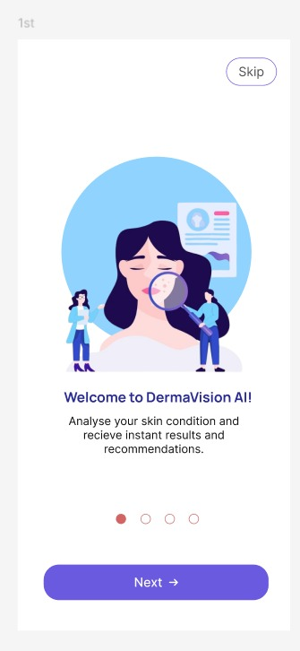
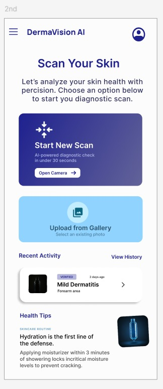
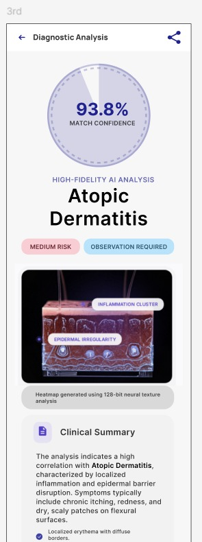
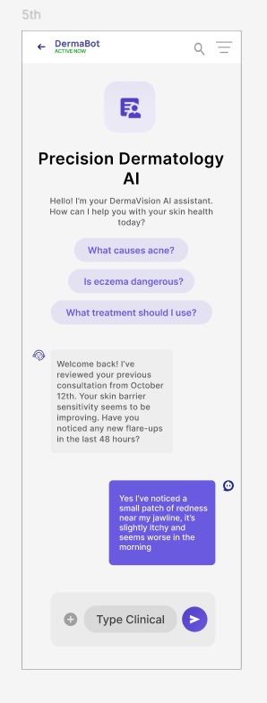
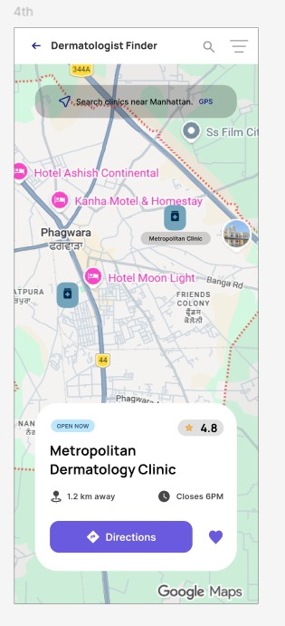

# dermavisionai-uiux
AI-powered dermatology assistant app UI/UX design
# DermaVision AI – UI/UX Case Study

## 📱 Overview

DermaVision AI is an AI-powered dermatology assistant app that helps users analyze skin conditions and connect with nearby dermatologists.

---

## 🎯 Problem

Early detection of skin diseases is often delayed due to lack of awareness and accessibility.

---

## 💡 Solution

A mobile app that allows users to:

* Scan or upload skin images
* Get AI-based diagnosis with confidence score
* View risk level and affected areas (heatmap)
* Get treatment suggestions
* Chat with AI assistant (DermaBot)
* Find nearby dermatologists via map

---

## 🔄 User Flow

Onboarding → Home → Scan → AI Analysis → Results → Advice → Chatbot → Dermatologist Finder

---

## 🎨 Design Highlights

* Clean and modern healthcare UI
* AI scanning animation
* Confidence meter & risk indicator
* Heatmap visualization
* Smooth and intuitive user flow

---

## 🛠 Tools Used

* Figma

---

## 📸 Screens

### Onboarding

### Home Screen

### AI Analysis

### Chatbot

### Dermatologist Finder

---

## ⚠️ Disclaimer

This app provides AI-based suggestions and is not a substitute for professional medical advice.

---

## 🙌 Feedback

I’d love to hear your feedback!
